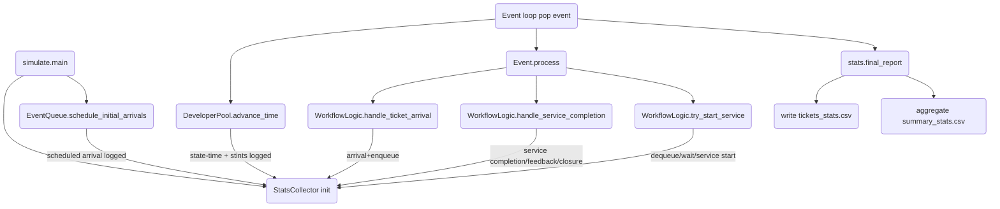

# Stats Pipeline (`simulation/stats.py`) — Evaluation & Update Semantics

## Overview
- **Instantiation:** `simulate.main()` builds a `SystemState`, then instantiates `StatsCollector(state)` before scheduling events and running the loop. The collector receives the shared `state`, configures output/log paths, and attaches a dedicated file handler so stats logs persist alongside the main simulation log.【F:simulation/simulate.py†L62-L108】【F:simulation/stats.py†L16-L60】
- **Event-driven updates:** Workflow events (arrivals, enqueues/dequeues, service starts/completions, feedback, closures) call `StatsCollector` hooks directly from `WorkflowLogic` and `SystemState` operations. Queue lengths and wait times are updated at each enqueue/dequeue/start, while feedback/closure data is recorded when routing or finishing tickets.【F:simulation/workflow_logic.py†L21-L157】【F:simulation/entities.py†L48-L86】【F:simulation/stats.py†L90-L187】
- **Developer policy integration:** The semi-Markov developer pool records state-time accruals and stint samples into stats during time advancement and service completions, letting utilization and stint metrics reflect capacity exposure over the whole run.【F:simulation/developer_policy.py†L88-L175】
- **Finalization:** At the end of the event loop, `stats.final_report()` writes per-ticket and summary CSVs, logs a concise summary to stdout/logfiles, and finalizes time-weighted queue areas through the simulation horizon to compute average queue lengths/utilizations.【F:simulation/stats.py†L241-L317】

## Key Classes/Functions
- **`StatsCollector`** (in `simulation/stats.py`)
  - Maintains per-ticket dictionaries (`ticket_stats`) capturing arrival time, queue waits, service histories, feedback, cycles, and closure timestamps. Provides `_ensure_ticket` and `_record_event` helpers to lazily initialize records and append timeline entries for later CSV export or debugging.【F:simulation/stats.py†L18-L118】
  - Tracks global counters in `event_counters` (scheduled arrivals, arrivals, per-stage service starts/completions, feedback counts, routing counts, closures) and per-stage accumulators for queue length areas, wait times, busy time, throughput, and service time samples. Developer-state timers and stint samples are also aggregated for utilization diagnostics.【F:simulation/stats.py†L25-L73】
  - Queue-length tracking uses `_tracking_stage` to normalize backlog events into the dev queue metric, `_update_queue_length` to integrate queue area between events, and `_finalize_queue_areas` to carry areas to the end of the simulation horizon before reporting averages.【F:simulation/stats.py†L120-L154】
  - Logging hooks (`log_arrival_event`, `log_enqueue`, `log_dequeue`, `log_queue_wait`, `log_service_start`, `log_service_completion`, `log_feedback`, `log_closure`) are invoked by workflow code to update counters, accumulate waits/service time, and capture feedback cycles. Each hook also emits structured timeline entries for the ticket and logs to the run logger.【F:simulation/stats.py†L156-L213】
  - Reporting helpers `_calculate_ticket_row`, `_write_ticket_csv`, `_aggregate_summary`, `_write_summary_csv` compute row-level metrics, aggregate KPIs (including queue-length, throughput, utilization, rework rates, stint stats), and persist CSV outputs consumed by sweeps/analyses.【F:simulation/stats.py†L215-L305】
  - Public `final_report` orchestrates writing CSVs and logging/printing a short summary (closure counts and selected throughput/closure metrics).【F:simulation/stats.py†L307-L317】
- **`EventQueue.schedule_initial_arrivals`** seeds the first arrival and logs the scheduled arrival through stats when provided.【F:simulation/events.py†L74-L84】
- **`WorkflowLogic` handlers** (`handle_ticket_arrival`, `try_start_service`, `_dequeue_from_source`, `handle_service_completion`) are the primary callers of stats hooks, ensuring all queue, wait, service, feedback, and closure events are captured in real time.【F:simulation/workflow_logic.py†L29-L157】【F:simulation/workflow_logic.py†L167-L213】
- **`DeveloperPool` integration** logs developer state time and stint lengths via `stats.log_developer_state_time` and `stats.log_developer_stint` inside time-advance and transition paths, enabling utilization denominators and stint statistics.【F:simulation/developer_policy.py†L123-L175】

## Metrics Dictionary
Metric definitions are derived directly from `StatsCollector` aggregation logic. All times are in **days** (matching `config.py`).【F:simulation/config.py†L1-L45】

| Metric | Definition | Update Trigger/Window | Stored At | Export/Consumption |
| --- | --- | --- | --- | --- |
| `tickets_arrived` | `event_counters['arrivals']` (count of arrival events within horizon). | Incremented in `log_arrival_event` per arrival. | Summary rows | `summary_stats.csv`; referenced by sweep aggregation. 【F:simulation/stats.py†L156-L189】【F:simulation/run_sweeps.py†L36-L83】|
| `tickets_closed` | `event_counters['closures']` (tickets processed to completion). | Set in `log_closure` when `SystemState.close_ticket` fires. | Summary rows | `summary_stats.csv`; sweep aggregate. 【F:simulation/stats.py†L185-L207】【F:simulation/run_sweeps.py†L36-L83】|
| `closure_rate` | `closures / arrivals` (0 if no arrivals). | Computed at final aggregation. | Summary rows | `summary_stats.csv`; sweep aggregate. 【F:simulation/stats.py†L244-L270】【F:simulation/run_sweeps.py†L36-L83】|
| `mean/median/p95_time_in_system` | Statistics over `final_time` per ticket (arrival→closure duration). | Calculated at final aggregation after queue area finalization. | Summary rows; per-ticket `time_in_system`. | `summary_stats.csv`, `tickets_stats.csv`. 【F:simulation/stats.py†L215-L262】【F:simulation/stats.py†L232-L240】|
| `mean_dev_cycles`, `mean_review_cycles`, `mean_test_cycles` | Mean cycles counted per stage across tickets. | Cycles incremented in `handle_service_completion`; aggregated at finalization. | Summary rows; cycles stored per ticket. | `summary_stats.csv`, `tickets_stats.csv`. 【F:simulation/stats.py†L270-L296】【F:simulation/workflow_logic.py†L69-L132】|
| `throughput_{stage}` | `stage_throughput[stage] / sim_duration` (completions per day). | `stage_throughput` incremented in `log_service_completion`; normalized over horizon. | Summary rows | `summary_stats.csv`; sweep aggregate. 【F:simulation/stats.py†L297-L331】|
| `avg_wait_{stage}` | Arithmetic mean of wait times recorded for the stage (`queue_wait_records`). | Wait times logged in `log_queue_wait` at service start; averaged at finalization. | Summary rows; per-ticket waits. | `summary_stats.csv`, `tickets_stats.csv`. 【F:simulation/stats.py†L171-L187】【F:simulation/stats.py†L297-L331】|
| `avg_queue_length_{stage}` | Time-weighted average queue/backlog length: queue area / horizon (backlog mapped to `dev`). | Queue area integrated on every enqueue/dequeue and finalized to horizon before aggregation. | `queue_tracking` | `summary_stats.csv`; sweep aggregate. 【F:simulation/stats.py†L120-L154】【F:simulation/stats.py†L297-L331】|
| `utilization_{stage}` | `(service_busy_time[stage]) / (horizon * avg_capacity)` where `avg_capacity` is the mean number of agents available for the stage, computed as total time developers spent in the mapped state (DEV/REV/TEST) divided by the horizon. | Busy time accrued at service start (bounded by horizon); developer state time logged during time advance and service completion. | Summary rows | `summary_stats.csv`; sweep aggregate. 【F:simulation/stats.py†L186-L213】【F:simulation/stats.py†L297-L331】【F:simulation/developer_policy.py†L94-L175】|
| `rework_rate_{stage}` | `feedback[stage] / service_completions[stage]` (0 if no completions). | Feedback counts incremented in `log_feedback`; completions in `log_service_completion`; computed at finalization. | Summary rows | `summary_stats.csv`. 【F:simulation/stats.py†L173-L204】【F:simulation/stats.py†L332-L347】|
| `markov_time_in_states` | `developer_state_time` totals by developer state (OFF/DEV/REV/TEST). | Accumulated every developer time advance and on service completion. | Summary rows; in-memory dict. | `summary_stats.csv`; sweep aggregate. 【F:simulation/stats.py†L61-L73】【F:simulation/stats.py†L348-L361】|
| `markov_stint_counts`, `markov_stint_means` | Count and mean length of stints observed per developer state (from `developer_stints`). | Logged when agents are initialized and when transitions draw new stints; aggregated at finalization. | Summary rows; `developer_stints`. | `summary_stats.csv`; sweep aggregate. 【F:simulation/developer_policy.py†L88-L175】【F:simulation/stats.py†L348-L361】|
| Per-ticket fields (`tickets_stats.csv`) | Arrival/closure times, total time in system, per-stage cycles, summed waits, total waits, summed service times, counts of service starts, and reserved Markov fields (empty placeholders). | Built from per-ticket histories at finalization via `_calculate_ticket_row`. | Per-ticket rows | `tickets_stats.csv` consumed by downstream analysis. 【F:simulation/stats.py†L215-L242】|

## Timing & Units
- **Base unit:** Days (per `config.py` docstring and service/arrival parameters).【F:simulation/config.py†L1-L45】
- **Event times:** All event timestamps and deltas are maintained in days. Queue waits are `current_time - queued_time`; service durations are sampled in days; developer stints are in days.【F:simulation/workflow_logic.py†L103-L150】【F:simulation/developer_policy.py†L123-L175】
- **Queue areas:** Time-weighted queue length integrates length × elapsed time between enqueue/dequeue events; `_finalize_queue_areas` extends the final segment to `sim_duration` so averages divide by the full horizon.【F:simulation/stats.py†L120-L154】【F:simulation/stats.py†L297-L331】
- **Utilization horizon:** Utilization divides busy time by `(sim_duration * average capacity)` where average capacity is developer state time in the mapped productive state divided by horizon; busy time is clipped if a service would extend past the horizon.【F:simulation/stats.py†L186-L213】【F:simulation/stats.py†L297-L331】
- **`avg_capacity` meaning:** For each stage, `avg_capacity` = `(developer_state_time[state] / horizon)`, so it represents the mean count of developers observed in the relevant Markov state (DEV for `dev`, REV for `review`, TEST for `testing`). The numerator (`service_busy_time[stage]`) accumulates actual service time booked at start events, while the denominator scales by how much capacity was present over time, allowing utilization to stay interpretable even when agents transition between states mid-run.【F:simulation/stats.py†L186-L213】【F:simulation/stats.py†L297-L331】【F:simulation/developer_policy.py†L123-L175】

## Exports & File Formats
- **Per-ticket CSV (`simulation/output/tickets_stats.csv`):** Header columns are fixed in `_write_ticket_csv`; rows are ordered by ticket id. Fields cover arrival/closure timestamps, total time in system, per-stage cycle counts, summed waits and service times, counts of service starts, and placeholder Markov columns kept for compatibility.【F:simulation/stats.py†L215-L242】
- **Summary CSV (`simulation/output/summary_stats.csv`):** Each row has `metric`, `value`, `units`, `description`. Metrics include arrivals/closures, closure rate, time-in-system stats, cycle averages, throughput, average waits, average queue lengths, utilization, rework rates, and developer-state diagnostics.【F:simulation/stats.py†L244-L361】
- **Logs:** A dedicated stats logfile (`simulation/logs/simulation_stats.log`) is created alongside the main simulation log, capturing every stats hook invocation plus final summary pointers.【F:simulation/stats.py†L52-L73】【F:simulation/stats.py†L307-L317】
- **Sweep consumption:** `simulation/run_sweeps.py` copies `summary_stats.csv`/`tickets_stats.csv` into experiment folders and builds an aggregate CSV using a fixed set of summary metrics (`SUMMARY_METRICS`). Only listed metrics are propagated into sweep aggregates, so additions to stats require updating this list for sweep visibility.【F:simulation/run_sweeps.py†L17-L152】【F:simulation/run_sweeps.py†L182-L233】

## Invariants & Debug Checklist
- **Arrival/closure balance:** `tickets_closed` ≤ `tickets_arrived`; closure rate should be in [0,1].【F:simulation/stats.py†L244-L270】
- **Queue length integration:** Queue lengths should never go negative due to `max(0.0, length + delta)` in `_update_queue_length`. Time-weighted averages must use the finalized areas through `sim_duration`.【F:simulation/stats.py†L120-L154】【F:simulation/stats.py†L297-L331】
- **Busy time bounds:** Busy time added at service start is clipped to the remaining horizon (`usable_time = max(0, min(service_time, sim_duration - start_time))`), preventing utilization from exceeding 1 solely due to services scheduled beyond the horizon.【F:simulation/stats.py†L186-L213】【F:simulation/stats.py†L297-L331】
- **Throughput vs completions:** `stage_throughput[stage] * sim_duration` should match `service_completions[stage]` counts. Rework rates use the same completion denominator. 【F:simulation/stats.py†L173-L204】【F:simulation/stats.py†L297-L347】
- **Per-ticket coherence:** For any ticket, total waits and service times per stage should sum the recorded waits/service start entries for that stage; closure timestamps should equal arrival time + `time_in_system`.【F:simulation/stats.py†L215-L242】【F:simulation/stats.py†L185-L207】
- **Developer time accounting:** Sum of `developer_state_time` divided by horizon should approximate the number of agents if no time is lost; stint counts/means should reflect every initialization and transition. Utilization denominators rely on these values, so missing state-time logs will distort utilization.【F:simulation/developer_policy.py†L123-L175】【F:simulation/stats.py†L297-L361】

## Call Graph / Update Flow

## Appendix
### Files & Symbols Referenced
- `simulation/stats.py`: `StatsCollector`, queue tracking helpers, reporting helpers, `final_report`.
- `simulation/simulate.py`: stats initialization and finalization timing.
- `simulation/workflow_logic.py`: hooks invoking stats during arrivals, starts, completions, feedback, closure.
- `simulation/entities.py`: `SystemState.close_ticket` calling `log_closure`.
- `simulation/developer_policy.py`: logging developer state time and stints.
- `simulation/events.py`: initial arrival scheduling and stats integration.
- `simulation/run_sweeps.py`: sweep consumption of `summary_stats.csv`/`tickets_stats.csv` metrics.
- `simulation/config.py`: units and parameter bases for timing semantics.

### Ambiguities / Unclear Items
- Reserved per-ticket Markov columns (`markov_time_*`, `markov_stint_counts`) are written as empty strings; their intended population is not implemented in `stats.py`, so downstream consumers may need to handle blanks explicitly.【F:simulation/stats.py†L215-L242】
- Utilization denominator uses developer state time as “average capacity”; if agents switch states mid-service, only start-time capacity is considered for busy time, which could diverge from true availability if state changes while busy. This is a modeling choice but not explicitly documented elsewhere.【F:simulation/stats.py†L186-L213】【F:simulation/developer_policy.py†L123-L175】
